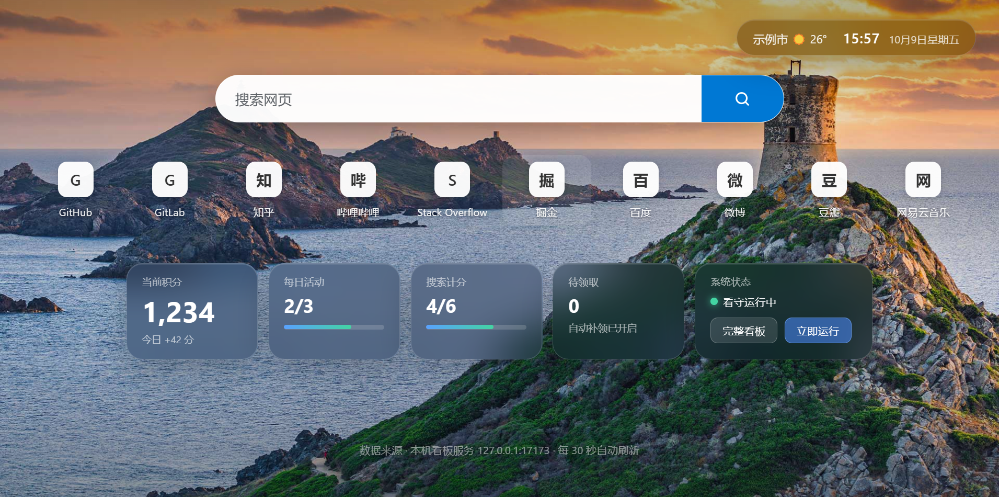

# edge-rewards-bot



微软积分（Edge 积分 · 中国版）每日自动获取脚本。
真实浏览器路线：Playwright 通过 CDP 接管专用 Edge 实例，全部操作走真实 UI。

## 目录

```
main.py            入口：完整每日管线
config.yaml        全部可调参数（搜索次数、节奏、通知等）
selectors.yaml     页面标记/选择器（微软改版后优先改这里）
core/browser.py    Edge 启动 / CDP 就绪检查
core/state.py      运行记录（state.json）
core/humanize.py   拟人化间隔/停留
tasks/rewards.py   面板操作：读状态 / 领取 / 每日活动
tasks/search.py    搜索：热点词 + 拟人化 + 上限熔断
notify.py          通知（默认关闭）
status.py          快速查状态（只读）
dashboard.py       本机看板服务（127.0.0.1:17173，同时是新标签页扩展的数据源）
dashboard.html     完整看板页
watch_edge.py      后台看守：检测到你打开 Edge 时自动跑一轮（当天一次）
edge-extension/    新标签页扩展：毛玻璃积分看板（安装见下）
launch_edge.ps1    手动启动带调试端口的 Edge
setup_schedule.ps1 注册每日计划任务（可选）
links.example.json 快捷方式配置示例（复制为 links.json 使用）
docs/              README 预览图
logs/              运行日志（本地生成，不入库）
计划书.md / 侦察报告.md   设计与机制文档
```

## 使用

1. 首次：`powershell -ExecutionPolicy Bypass -File launch_edge.ps1`
   在弹出的窗口登录微软账号（仅一次，之后登录态常驻专用 profile）。
2. 日常运行：
   ```
   .venv\Scripts\python main.py
   ```
   可选参数：`--search-count N`（临时覆盖搜索次数）`--no-search` `--no-activities`
            `--visible`（不最小化窗口，调试用）
   快速查状态（只读）：`.venv\Scripts\python status.py`
3. 自动触发（当前配置）：除后台看守外**不装任何定时任务** ——
   只在"你打开 Edge"时自动跑一轮（当天一次，已跑过则跳过）。
   恢复定时任务：`powershell -ExecutionPolicy Bypass -File setup_schedule.ps1`；
   移除：`Unregister-ScheduledTask -TaskName EdgeRewards-AM,EdgeRewards-PM`。
4. 后台看守（自动触发的唯一来源）：登录后常驻一个静默进程，检测到你
   **手动启动 Edge** 时自动在后台跑一轮（无控制台、浏览器窗口最小化）。
   当天已跑过自动跳过，3 小时内不重复；看板服务每 2 分钟保活（看守意外
   退出会自动拉起）；总开关：config.yaml 中 `watch.enabled`。
   - 自启：计划任务 `EdgeRewards-Services`（登录触发，不依赖资源管理器）
     + 启动文件夹快捷键双保险；重复启动由单实例锁自动去重
   - 调试观察：`logs/watch.log`
   - 临时禁用：删除启动文件夹中的 `EdgeRewardsWatch.lnk`（并结束 pythonw 进程）
   - 关闭后台最小化：config.yaml 中 `edge.background: false`，或运行 `main.py --visible`

## 快捷方式配置（可选）

新标签页快捷方式来自三处（自动去重合并）：`links.json`（自定义）、
Edge 书签（custom_links）、Edge 常用站点（Top Sites）。
自定义：复制 `links.example.json` 为 `links.json` 后增删条目。

## 看板

- 访问：<http://127.0.0.1:17173/>（登录后自动启动；手动启动 `.venv\Scripts\pythonw.exe dashboard.py`）
- 内容：今日战报 / 任务进度 / 近 14 天收益曲线 / 最近运行 / 系统状态 / 今日日志
- 「实时读取」按钮：直连 Edge 读当前积分面板（余额、待领取、打卡状态）
- 「立即运行」按钮：手动触发一轮完整任务
- 桌面快捷方式：`EdgeRewards Dashboard`（双击即开）

### 首页看板（浏览器扩展 v2.0.0）

扩展本体：`edge-extension/`。装好后，**新标签页由扩展接管**：

- 点 Edge 图标 / Ctrl+T 打开的就是「必应每日壁纸 + 搜索框 + 快捷方式 + 天气时钟 + 毛玻璃积分看板」
- 五张毛玻璃卡片（背景壁纸透出、不阻挡视线）：当前积分 / 每日活动 / 搜索计分 / 待领取 / 系统状态
- 「立即运行」一键触发一轮任务；「完整看板」跳转本机看板页
- 搜索框直连必应；快捷方式从本机看板服务同步（links.json + Edge 常用站点）

安装（一次性，30 秒）：

1. 地址栏打开 `edge://extensions`
2. 左下角打开「开发人员模式」（已开过则跳过）
3. 已装有其它新标签页扩展（如「Fatfox新标签页」）也可直接装：实测 Edge 让「后安装的」接管新标签页；万一 Ctrl+T 看到的仍是旧页面，再把它禁用/移除即可
4. 点「加载解压缩的扩展」，选择 `<项目目录>\edge-extension`
5. Ctrl+T 验证：应看到壁纸 + 毛玻璃卡片

说明：

- 依赖本机看板服务（127.0.0.1:17173，登录自启）；服务暂不可用时页面自动降级，
  恢复后 30 秒内自动补全（无需刷新）；手动启动：`.venv\Scripts\pythonw.exe dashboard.py`
- 不想要看板：`edge://extensions` 里禁用/移除「积分看板（Edge Rewards）」即恢复原生新标签页
- 壁纸为必应每日图（实时），离线时自动回退纯色

## 已验证机制（2026-10-07 实测）

- 领取：面板"领取"→弹窗"领取"→精确到账
- 每日活动：面板内点击卡片（触发服务端 action）→ 验证"已完成"；偶发延迟 → 重试一次
- 搜索：每次 +3 分；打卡独立结算
- 搜索计分上限：约 15 分/天（前 5 次计分），脚本 early-stop 自动熔断
- 签到（必应应用）：移动端专属，桌面端跳过
- 勋章余额读取：`#rh_rwm` 的 `data-content`（base64 JSON）

## 排错

- CDP 不通：确认 9222 端口空闲，或直接运行 `launch_edge.ps1`
- 页面改版：先改 `selectors.yaml`；仍不通再改 `tasks/rewards.py` 内的 JS 片段
- 风控信号命中：脚本自动中止，检查 `logs/` 与 `recon/` 截图
